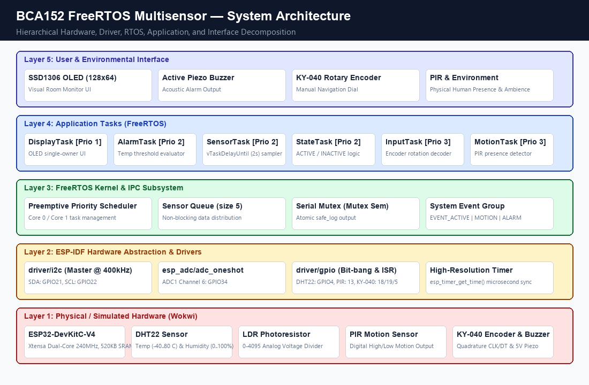
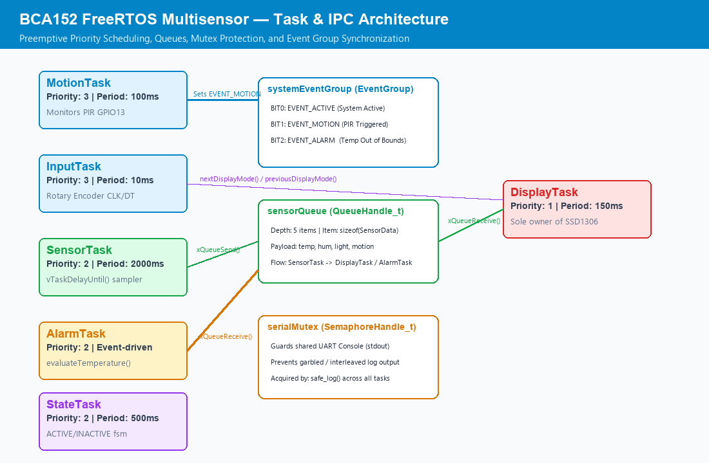
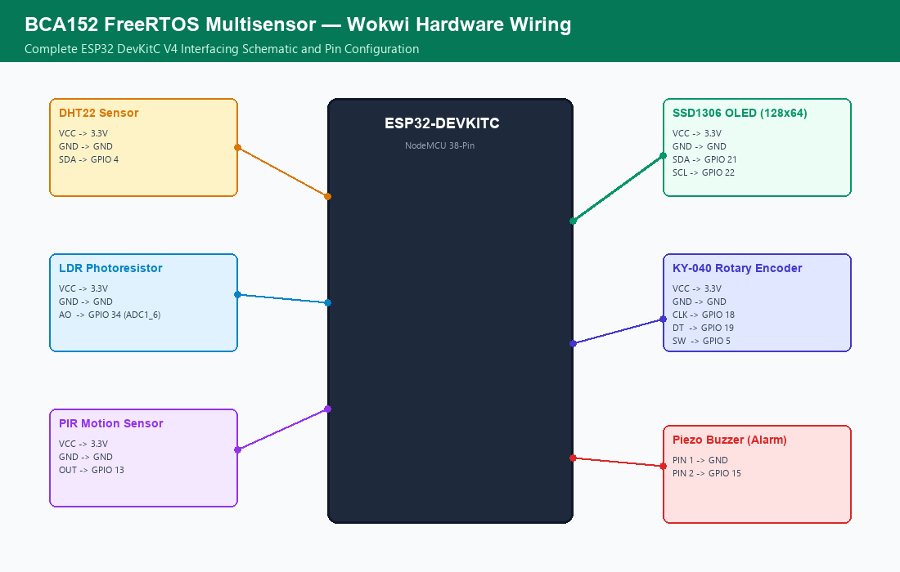
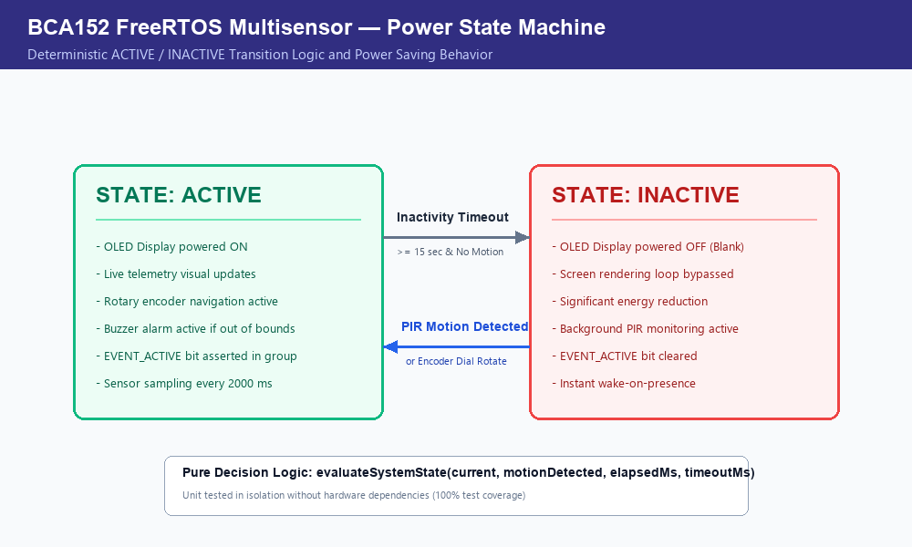
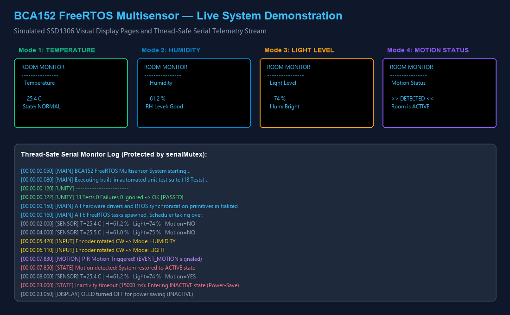

# Real-Time FreeRTOS Multisensor Room Monitoring System

[](https://platformio.org/)
[](https://www.freertos.org/)
[](https://www.espressif.com/)
[](LICENSE)

An industrial-grade, concurrent embedded room-monitoring system designed and implemented on the **ESP32** using native **ESP-IDF** and **FreeRTOS** APIs (strictly avoiding Arduino framework abstractions). The project features multi-sensor telemetry, quadrature rotary dial navigation, acoustic threshold alarming, a power-saving state machine, and comprehensive automated test coverage.

Developed for **BCA152 Microcontrollers**, Department of Computer Applications, College of Computer Studies, **Mindanao State University - Iligan Institute of Technology (MSU-IIT)**.

---

## Project Overview
The **BCA152 FreeRTOS Multisensor** is a simulated embedded edge node executed in **Wokwi**. The system concurrently monitors environmental telemetry (temperature, relative humidity, and ambient light level), detects human presence, provides an intuitive rotary-encoder-driven graphical dashboard on a 128x64 OLED display, triggers audible alerts during thermal anomalies, and autonomously manages device power states based on physical occupancy.

---

## Features
- **Concurrent Preemptive Multi-Tasking**: Six dedicated FreeRTOS tasks with strictly prioritized scheduling.
- **Drift-Free Periodic Sensor Acquisition**: Uses `vTaskDelayUntil()` to eliminate periodic cumulative timing drift.
- **Inter-Task Communication (IPC)**: Thread-safe data transfer across tasks using a FreeRTOS `QueueHandle_t`.
- **Atomic Serial Logging**: Console prints protected by a dedicated FreeRTOS `SemaphoreHandle_t` (Mutex).
- **System Event Signaling**: Event-driven flags (`EVENT_ACTIVE`, `EVENT_MOTION`, `EVENT_ALARM`) managed via an `EventGroupHandle_t`.
- **Autonomous Anomaly Alarming**: Active piezo buzzer sounds whenever room temperature exits the safe [18.0 °C – 30.0 °C] bracket.
- **Continuous Circular Navigation**: KY-040 rotary dial switches among 4 dashboard views with bidirectional wraparound.
- **Occupancy-Based Power Management**: Transitions to `INACTIVE` state after 15 seconds of inactivity, blanking the OLED to save power while maintaining background PIR detection.
- **100% Automated Unit Test Verification**: 13 unit tests verifying decision logic with zero failures.

---

## Learning Objectives
- Architect and build an ESP32 firmware project using **PlatformIO** and native **ESP-IDF**.
- Interface physical/simulated embedded sensors and actuators (DHT22, LDR, PIR, KY-040, SSD1306, Buzzer).
- Design a modular, decoupled C/C++ embedded firmware codebase separating drivers from pure logic.
- Master FreeRTOS concurrency primitives: Task priorities, `vTaskDelayUntil()`, Queues, Mutexes, and Event Groups.
- Differentiate FreeRTOS task lifecycle states: **Running**, **Ready**, **Blocked**, and **Suspended**.
- Implement a deterministic embedded state machine for low-power operation.
- Write and execute automated unit tests using **Unity**.
- Execute static code analysis with **cppcheck** (`pio check`) and resolve architectural defects.

---

## System Architecture
The firmware is structured into a 5-tier modular architecture ensuring high maintainability and testability:


*Figure 1: Layered system architecture from physical sensors to presentation dashboard.*

1. **Physical & Simulated Hardware**: ESP32, DHT22, LDR, PIR, KY-040 encoder, SSD1306 OLED, and piezo buzzer.
2. **ESP-IDF HAL & Device Drivers**: Bit-banged timing, ADC oneshot sampling, and I2C master peripheral communication.
3. **FreeRTOS Synchronization Subsystem**: Preemptive scheduler, thread-safe queues, binary mutexes, and event flags.
4. **Application Tasks**: Dedicated functional threads with explicit priority assignments.
5. **Presentation & Actuation**: Visual display rendering and acoustic alarm alerts.

---

## FreeRTOS Architecture
The system schedules six concurrent tasks using preemptive priority-based scheduling:


*Figure 2: FreeRTOS task interaction, IPC queues, mutex protection, and event dispatch.*

### Task Schedule & IPC Matrix:
| Task Name | Priority | Period / Trigger | IPC Mechanism | Typical Blocked Condition | Primary Responsibility |
|---|---|---|---|---|---|
| **MotionTask** | 3 | 100 ms periodic | Event Group (`EVENT_MOTION`) | `vTaskDelay(100ms)` | Detects PIR edge events, updates motion state |
| **InputTask** | 3 | 10 ms periodic | Direct / Shared Mode | `vTaskDelay(10ms)` | Samples encoder quadrature signals, triggers navigation |
| **SensorTask** | 2 | 2000 ms periodic | Queue (`sensorQueue`) | `vTaskDelayUntil(&wake, 2000ms)` | Acquires DHT22 and LDR data, broadcasts packet |
| **AlarmTask** | 2 | Event-driven (Queue) | Queue (`sensorQueue`) | `xQueueReceive(sensorQueue)` | Evaluates temperature bounds, activates buzzer |
| **StateTask** | 2 | 500 ms periodic | Event Group (`EVENT_ACTIVE`) | `vTaskDelay(500ms)` | Inactivity tracking and power mode transitions |
| **DisplayTask** | 1 | 150 ms periodic | Queue / Shared Cache | `xQueueReceive() / Delay` | Single owner of OLED, renders dashboard |

---

## Hardware / Simulated Components
| Component | Model | Interface Type | Functional Purpose |
|---|---|---|---|
| **Microcontroller** | ESP32-DevKitC-V4 | Xtensa 240MHz | Core processing, FreeRTOS scheduler |
| **Temperature & Humidity** | DHT22 (AM2302) | 1-Wire Digital | Ambient temperature & relative humidity |
| **Ambient Light** | Photoresistor (LDR) | Analog ADC (12-bit) | Relative ambient illumination (0–100%) |
| **Motion Detection** | PIR Sensor | Digital Input | Human presence monitoring |
| **User Navigation** | KY-040 Rotary Encoder | Quadrature CLK/DT/SW | Dial-based dashboard page switching |
| **Display Dashboard** | SSD1306 OLED (128x64) | I2C (Address `0x3C`) | Graphical telemetry display |
| **Alarm Output** | Active Piezo Buzzer | Digital Output | Acoustic notification on critical temperatures |

---

## Pin Configuration
Complete wiring mapping as configured in `diagram.json`:


*Figure 3: Wokwi circuit schematic and ESP32 pin wiring.*

| ESP32 Pin | Peripheral Pin | Signal Function | Electrical Notes |
|---|---|---|---|
| **GPIO 4** | DHT22 `SDA` | Digital 1-Wire Data | Open-drain with internal pull-up |
| **GPIO 34** | LDR `AO` | Analog Input | ADC1 Channel 6 (Input-only pin) |
| **GPIO 13** | PIR `OUT` | Digital Input | Pulled down internally; goes HIGH on motion |
| **GPIO 18** | Encoder `CLK` | Quadrature Channel A | Internal pull-up enabled |
| **GPIO 19** | Encoder `DT` | Quadrature Channel B | Internal pull-up enabled |
| **GPIO 5** | Encoder `SW` | Push-Button Switch | Internal pull-up enabled |
| **GPIO 21** | SSD1306 `SDA` | I2C Data | 400 kHz Fast-Mode I2C Bus |
| **GPIO 22** | SSD1306 `SCL` | I2C Clock | 400 kHz Fast-Mode I2C Bus |
| **GPIO 15** | Buzzer `Pin 2 (+)` | Digital Output | Active-HIGH buzzer control |
| **3.3V / 5V** | Peripheral `VCC` | Power Supply | Common 3.3V DC rail |
| **GND** | Peripheral `GND` | Ground Reference | Common ground plane |

---

## Task Design & Priority Justifications
In real-time systems, priorities denote **scheduling urgency and latency tolerance**, not arbitrary importance:

1. **`MotionTask` (Priority 3 - High)**: Detects brief electrical pulses from the PIR sensor. If preempted or delayed, the system risks missing human presence events, delaying room wake-up.
2. **`InputTask` (Priority 3 - High)**: Serves user mechanical rotation. Requires high sample frequency (10 ms) to avoid missing quadrature transitions or feeling sluggish.
3. **`SensorTask` (Priority 2 - Medium)**: Executes every 2.0 seconds. Timing is strictly governed by `vTaskDelayUntil()`.
4. **`AlarmTask` (Priority 2 - Medium)**: Reacts immediately upon receiving new telemetry from `sensorQueue`. Evaluates temperature bounds without delaying lower tasks.
5. **`StateTask` (Priority 2 - Medium)**: Evaluates elapsed inactivity intervals and updates system power state flags.
6. **`DisplayTask` (Priority 1 - Low)**: Visual rendering takes several milliseconds over I2C. Because human eyes cannot perceive millisecond frame delays, `DisplayTask` runs in the background and will never starve critical input or sensor acquisition.

---

## Inter-Task Communication

### 1. FreeRTOS Queue (`sensorQueue`)
A fixed-depth queue (`xQueueCreate(5, sizeof(SensorData))`) transfers structured sensor packets from `SensorTask` to consumers without unsynchronized global state variables:
```cpp
struct SensorData {
    float temperature;
    float humidity;
    int   lightLevel;
    bool  motionDetected;
};
```

### 2. Mutex Semaphore (`serialMutex`)
When multiple tasks execute `safe_log()`, concurrent writes to UART stdout can cause character interleaving:
```
[SEN[INPUT] Encoder rotatSOR] T=25.4 C... (CORRUPTED)
```
`serialMutex` ensures every log line is printed atomically:
```cpp
xSemaphoreTake(serialMutex, portMAX_DELAY);
printf("[%s] %s\n", tag, buffer);
xSemaphoreGive(serialMutex);
```

### 3. Event Group (`systemEventGroup`)
Synchronizes binary system flags across independent modules:
- `EVENT_ACTIVE (1 << 0)`: Asserted when system is awake; cleared when in power-save mode.
- `EVENT_MOTION (1 << 1)`: Asserted while PIR detects motion.
- `EVENT_ALARM  (1 << 2)`: Asserted during out-of-bounds temperature anomalies.

---

## State Machine
The firmware implements an occupancy-based power-saving state machine:


*Figure 4: Power management finite state machine (ACTIVE / INACTIVE).*

- **`ACTIVE` Mode**: OLED display powered ON, real-time visual refresh, audible alarm enabled, rotary navigation active.
- **`INACTIVE` Mode**: Automatically triggered after **15 seconds** of inactivity. The OLED is powered off (`display_set_power(false)`), suppressing unnecessary I2C bus traffic and saving energy while background PIR surveillance continues.
- **Restoration**: The moment PIR motion is detected or the encoder dial is turned, the system instantly returns to `ACTIVE` mode.

---

## Repository Structure
```
bca152-freertos-multisensor/
├── .gitignore
├── CMakeLists.txt
├── diagram.json             # Wokwi circuit schematic
├── platformio.ini           # PlatformIO project configuration
├── pre_build_git_fix.py     # CMake build hook
├── sdkconfig.esp32dev       # ESP-IDF SDK configuration
├── wokwi.toml               # Wokwi simulation configuration
├── include/                 # Modular header files
│   ├── alarm.h
│   ├── display.h
│   ├── input.h
│   ├── motion.h
│   ├── rtos_objects.h
│   ├── sensors.h
│   └── system_state.h
├── lib/                     # Project-specific private libraries
├── src/                     # Modular C++ implementation files
│   ├── CMakeLists.txt
│   ├── alarm.cpp
│   ├── display.cpp
│   ├── input.cpp
│   ├── main.cpp             # Focused orchestration entry point
│   ├── motion.cpp
│   ├── rtos_objects.cpp
│   ├── sensors.cpp
│   └── system_state.cpp
├── test/                    # Automated Unit Tests
│   ├── README
│   └── test_main.cpp        # 13 Unity automated test cases
└── docs/                    # Architectural diagrams and reports
    ├── HACKSTER.md          # Hackster.io portfolio publication
    ├── freertos_architecture.png
    ├── laboratory-report.pdf # Formal academic report
    ├── state_machine.png
    ├── system_architecture.png
    ├── system_running.png
    └── wokwi_circuit.png
```

---

## Getting Started

### Prerequisites
- [VS Code](https://code.visualstudio.com/) with **PlatformIO IDE** extension installed.
- [Wokwi for VS Code](https://marketplace.visualstudio.com/items?itemName=Wokwi.wokwi-vscode) extension.
- Git version control.

---

## Building the Project
Clone the repository and compile using PlatformIO:
```bash
git clone https://github.com/mccdz1/bca152-freertos-multisensor.git
cd bca152-freertos-multisensor
pio run
```
Build output produces `.pio/build/esp32dev/firmware.bin` and `.elf`.

---

## Running the Wokwi Simulation
1. Open the project folder in VS Code.
2. Open `diagram.json`.
3. Press `F1` and select **Wokwi: Start Simulator** (or click the green Play button in the Wokwi tab).
4. Observe the SSD1306 display and the serial console output.


*Figure 5: Live system demonstration showing OLED screen views and serial logging.*

---

## Unit Testing
The project separates hardware-independent decision logic into pure functions, verified by 13 automated tests using **Unity**:
```bash
pio test
```
### Test Coverage Matrix:
- **Temperature Alarm Logic (5 tests)**:
  - `test_temperature_below_low_limit` (17.9 °C $\rightarrow$ `LOW_TEMPERATURE`)
  - `test_temperature_at_low_limit` (18.0 °C $\rightarrow$ `NORMAL`)
  - `test_temperature_normal_mid` (24.5 °C $\rightarrow$ `NORMAL`)
  - `test_temperature_at_high_limit` (30.0 °C $\rightarrow$ `NORMAL`)
  - `test_temperature_above_high_limit` (30.1 °C $\rightarrow$ `HIGH_TEMPERATURE`)
- **Display Navigation (4 tests)**:
  - `test_navigation_forward_step` (`TEMPERATURE` $\rightarrow$ `HUMIDITY`)
  - `test_navigation_reverse_step` (`HUMIDITY` $\rightarrow$ `TEMPERATURE`)
  - `test_navigation_forward_wraparound` (`MOTION` $\rightarrow$ `TEMPERATURE`)
  - `test_navigation_reverse_wraparound` (`TEMPERATURE` $\rightarrow$ `MOTION`)
- **System State Machine (4 tests)**:
  - `test_system_state_active_no_timeout` (`ACTIVE` + elapsed < timeout $\rightarrow$ `ACTIVE`)
  - `test_system_state_active_timeout_reached` (`ACTIVE` + elapsed $\ge$ timeout $\rightarrow$ `INACTIVE`)
  - `test_system_state_inactive_no_motion` (`INACTIVE` + no motion $\rightarrow$ `INACTIVE`)
  - `test_system_state_inactive_motion_detected` (`INACTIVE` + motion $\rightarrow$ `ACTIVE`)

**Result**: `13 Tests 0 Failures 0 Ignored -> OK [PASSED]`

---

## Static Code Analysis
Run static analysis via PlatformIO's integrated **cppcheck**:
```bash
pio check
```
### Findings Summary:
- **Checked Components**: All source files in `src/` and `include/`.
- **Defects Found**: `0 High`, `0 Medium`, `0 Low`.
- **Result**: `[PASSED] Took 1.33 seconds`.

---

## Functional Verification
| Test ID | Test Stimulus | Expected Behavior | Observed Result | Status |
|---|---|---|---|---|
| **FT-01** | Modify DHT22 temperature | OLED temperature updates | Temperature reflects slider value | **PASS** |
| **FT-02** | Modify DHT22 humidity | OLED humidity updates | Humidity reflects slider value | **PASS** |
| **FT-03** | Adjust LDR light sensor | Light level percentage updates | Linear scaling from 0 to 100% | **PASS** |
| **FT-04** | Rotate encoder clockwise | Next dashboard page selected | Temp $\rightarrow$ Hum $\rightarrow$ Light $\rightarrow$ Motion | **PASS** |
| **FT-05** | Rotate encoder counter-clockwise | Previous page selected with wrap | Temp $\rightarrow$ Motion $\rightarrow$ Light $\rightarrow$ Hum | **PASS** |
| **FT-06** | Increase temperature $> 30.0$ °C | Buzzer activates, OLED shows ALARM | Buzzer sounds, status shows ALARM | **PASS** |
| **FT-07** | Restore temperature to 24.5 °C | Buzzer silences, status NORMAL | Buzzer turns off immediately | **PASS** |
| **FT-08** | Trigger PIR motion | System remains/asserts ACTIVE | EVENT_MOTION flag set | **PASS** |
| **FT-09** | Wait 15 seconds without motion | System transitions to INACTIVE | OLED blanks, power reduced | **PASS** |
| **FT-10** | Trigger PIR while INACTIVE | System restores to ACTIVE | OLED turns on immediately | **PASS** |

---

## Engineering Decisions
1. **`vTaskDelayUntil()` vs `vTaskDelay()`**: `vTaskDelayUntil()` sets the wake tick relative to the previous wake tick, guaranteeing a strict 2000 ms periodic rate regardless of sensor I/O latency.
2. **Display Single-Ownership**: Only `DisplayTask` is permitted to interface with the SSD1306 over I2C. All other tasks send data via queues or caches, eliminating I2C bus collision risks.
3. **Pure Function Separation**: Decoupling evaluation logic from hardware drivers allowed exhaustive automated unit testing on the host without requiring physical hardware in the loop.

---

## Limitations
- **Simulation Environment**: Wokwi operates with idealized digital signals; physical hardware would require contact debouncing capacitors and analog ADC calibration curves.
- **Volatile Storage**: Thresholds and state are kept in RAM and reset upon MCU reboot.

---

## Future Improvements
- Implement Non-Volatile Storage (NVS) to persist user-configured temperature limits.
- Add ESP32 deep-sleep modes using the Ultra-Low-Power (ULP) co-processor.
- Integrate MQTT / AWS IoT Core telemetry publishing over Wi-Fi.

---

## References and Acknowledgments
- [FreeRTOS API Reference Manual](https://www.freertos.org/Documentation/02-Kernel/04-API-references/00-Index)
- [Espressif ESP-IDF Programming Guide](https://docs.espressif.com/projects/esp-idf/)
- [Wokwi Simulation Documentation](https://docs.wokwi.com/)
- Course Instructor: **Paul Rodolf P. Castor** ([paulrodolf.castor@g.msuiit.edu.ph](mailto:paulrodolf.castor@g.msuiit.edu.ph)), Department of Computer Applications, MSU-IIT.
